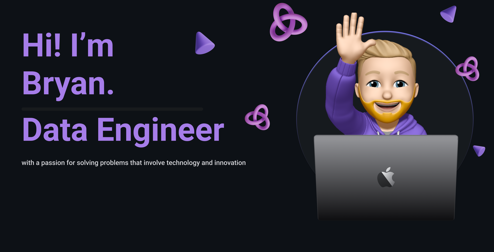

  

<h3 align="center">
Hi there, I'm <a>Bryan</a> 👋
</h3>

<h2 align="center">
I'm a Data Engineer 💻 and Hobby Photographer 📸
</h2> 

I love the entire process of developing software. That may be data pipelines, API's or websites. I love the challenge of 

### 🤝 Connect with me:

## 🔭 I'm currently working on

- The [Advent of Code](https://adventofcode.com/) challenge: [My code](https://github.com/bryanlusse/aoc)

## 🌱 I'm currently learning

- 💻 Apache Spark
- 🇵🇹 Portuguese

## 💼 Technical Skills

 

 

## 📈 GitHub Stats 

